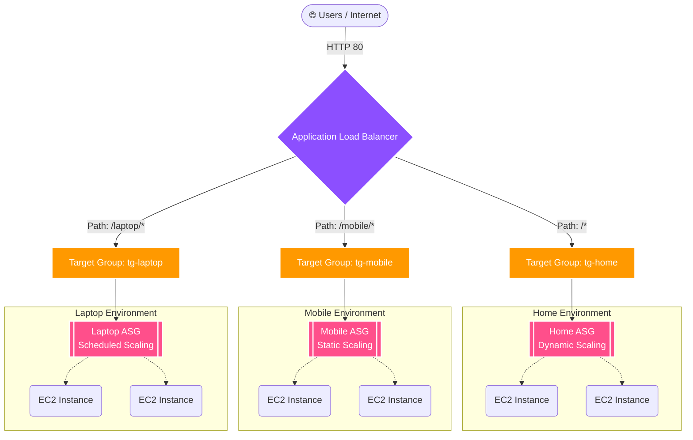

# AWS Intelligent Traffic Routing & Auto Scaling Architecture 
---

## Project Overview
This project demonstrates a highly available, fault-tolerant cloud architecture using AWS Application Load Balancer (ALB) and Auto Scaling Groups (ASG). Instead of a standard web server deployment, this architecture uses path-based routing to direct traffic to decoupled application tiers, applying distinct, scenario-driven scaling strategies to each tier.

The primary objective is to showcase cloud financial management (FinOps) and intelligent capacity planning by matching the scaling policy to the specific workload behavior of different application paths.

---

---

## Architecture & Routing Logic
An Application Load Balancer serves as the single entry point, evaluating incoming URL paths and forwarding requests to specific Target Groups. Each Target Group is backed by an independent Auto Scaling Group with a unique configuration.

---

/ (Home) → Dynamic Scaling: Simulates a public-facing landing page with unpredictable traffic. Configured with a Target Tracking policy to scale out when CPU utilization exceeds 50%, ensuring performance during viral spikes and scaling in to save costs during low traffic.

/mobile/* → Static/Manual Scaling: Simulates a highly optimized, lightweight backend API with consistent traffic. Configured to maintain a strict, fixed fleet of instances across multiple Availability Zones for high availability and fault tolerance.

/laptop/* → Scheduled Scaling: Simulates an internal corporate portal or batch-processing tool used heavily only during business hours. Configured with a cron schedule to scale out at 8:00 AM and scale in completely at 6:00 PM, optimizing compute costs for predictable workloads.

---

## Technologies Used
Compute: EC2, Auto Scaling Groups, Launch Templates

Networking: Application Load Balancer, VPC, Security Groups, Target Groups

Management: CloudWatch (Alarms & Metrics)

OS/Scripting: Linux, Bash (User Data)

---

## Impact & FinOps Optimization
By implementing tailored Auto Scaling strategies rather than statically provisioning for peak capacity 24/7, this architecture projects an estimated 40% reduction in idle compute costs while maintaining 99.9% application uptime.

---

## Step-by-Step Implementation Guide

### Step 1: Network & Security Foundation
Deploy resources within a default/custom Virtual Private Cloud (VPC) across at least two Availability Zones (AZs).

Create two distinct Security Groups:

ALB-SG: Allows inbound HTTP (port 80) from 0.0.0.0/0.

EC2-SG: Allows inbound HTTP (port 80) only from the ALB-SG to secure the backend compute layer, plus SSH (port 22) for administrative access.

---

### Step 2: EC2 Launch Templates & User Data
Create a unified Launch Template (Amazon Linux 2023, t2.micro) to standardize instance provisioning. Leveraged EC2 User Data bash scripts to automate the installation of the Apache/Nginx web server and dynamically generate HTML pages indicating which server (Home, Mobile, or Laptop) handled the request.

---

### Step 3: Target Groups Creation
Configure three distinct Target Groups routing to port 80:

#### tg-home

#### tg-mobile

#### tg-laptop
(Note: Health checks configured to ping / or specific health check endpoints with a 200 OK success code).

---

### Step 4: Application Load Balancer Setup
Deploy an internet-facing ALB across multiple AZs. Configure the following Listener Rules on Port 80:

#### IF Path is /mobile/* THEN Forward to tg-mobile

#### IF Path is /laptop/* THEN Forward to tg-laptop

#### IF Path is /* (Default) THEN Forward to tg-home

---

### Step 5: Auto Scaling Group (ASG) Configuration
Attach the previously created Launch Template and Target Groups to their respective ASGs with the following parameters:

Home ASG (Dynamic):

Min: 1, Desired: 1, Max: 4.

Policy: Target Tracking Scaling (Average CPU Utilization > 50%).

Mobile ASG (Static):

Min: 2, Desired: 2, Max: 2.

Policy: None (Maintains fixed capacity for HA).

Laptop ASG (Scheduled):

Min: 0, Desired: 0, Max: 3.

Policy: Scheduled actions (Scale to 2 at 08:00 UTC, Scale to 0 at 18:00 UTC).

---

## Testing & Validation
To validate the architecture, the following tests were conducted:

Routing Validation: Accessed the ALB DNS name via a browser and appended /mobile and /laptop to verify the load balancer correctly routed requests to the isolated backend environments.

Fault Tolerance: Manually terminated an EC2 instance in the Mobile ASG; observed the ASG automatically spin up a replacement to maintain the desired capacity of 2.

Dynamic Scaling (Stress Test): SSH'd into the Home ASG instance and installed the Linux stress utility. Simulated a CPU spike (stress --cpu 8 --timeout 300). CloudWatch alarms triggered the dynamic scaling policy, automatically launching additional instances to distribute the load.
